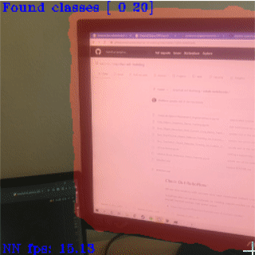

# Deeplabv3 multiclass on DepthAI 

This example shows how to run DeeplabV3+ on DepthAI.  The model has a MobilenetV2 backbone and is trained on Pascal VOC 2012 dataset. It contains the following classes:

- *Person:* person
- *Animal:* bird, cat, cow, dog, horse, sheep
- *Vehicle:* aeroplane, bicycle, boat, bus, car, motorbike, train
- *Indoor:* bottle, chair, dining table, potted plant, sofa, tv/monitor


You can find the tutorial for training the model and generation of *.blob* file [here](https://github.com/luxonis/depthai-ml-training/tree/master/colab-notebooks) - **DeepLabV3plus_MNV2.ipynb** [](https://colab.research.google.com/github/luxonis/depthai-ml-training/blob/master/colab-notebooks/DeepLabV3plus_MNV2.ipynb). You can create a copy of the Colab Notebook and try training the model on your own!

See the example in action detecting monitor and a person:



## Installation

```
python3 -m pip install -r requirements.txt
```

## Usage

Run the application.

```
python3 main.py

optional arguments:
  -h, --help            show this help message and exit
  -cam {left, rgb, right}, --cam-input {left, rgb, right}
                        Choose camera for inference source (rgb is default)
```
