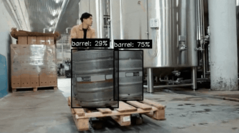

# Multi-Input YOLO World Demo README

This example demonstrates the implementation of multi-input [YOLO-World](https://github.com/AILab-CVC/YOLO-World) object detection pipeline on DepthAI. The experiment works only on RVC4.

## Demo



## Features

- Detect objects in real-time using YOLO.
- Support for video files and live camera input.
- Customizable class names and confidence threshold.

## Installation

1. Install the required Python libraries:
   ```bash
   pip install -r requirements.txt
   ```
1. Ensure a DepthAI-compatible device is available and configured.

## Usage

Run the script with the required arguments:

```bash
python main.py --device <DEVICE> --class_names <CLASS_NAMES> [OPTIONS]
```

### Required Arguments

- `--device`: Optional name, DeviceID or IP of the camera to connect to.
- `--class_names`: Space-separated list of class names to detect (up to 80 classes).

### Optional Arguments

- `--video_path`: Path to the video file for processing. If omitted, live camera input is used.
- `--confidence_threshold`: Confidence threshold for detections (default: 0.1).

### Example

Running with a depthai visualizer:

```bash
python main.py --class_names person car dog --confidence_threshold 0.2
```
