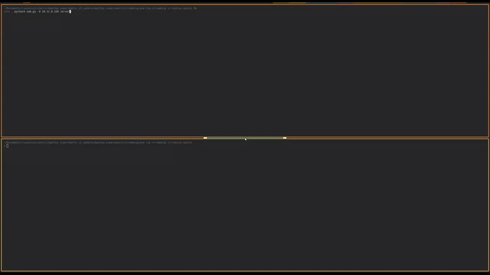

# PoE TCP Streaming

This example demonstrates, how to stream video from the device to the host computer using TCP protocol. It establishes bidirectional communication between the device and the host.

## Demo



## Usage

Running this example requires a **Luxonis device** connected to your computer. Refer to the [documentation](https://docs.luxonis.com/software-v3/) to setup your device if you haven't done it already.

You can run the example fully on device ([`STANDALONE` mode](#standalone-mode-rvc4-only)) or using your computer as host ([`PERIPHERAL` mode](#peripheral-mode)).

This example contains two scripts: `host.py` and `oak.py`. `oak.py` is the script responsible for setting up the DepthAI pipeline and running it on the device and `host.py` is the script that runs on the host computer. Both scripts support two modes: `server` and `client`. When running in `server` mode the script will act as a server and wait for a connection. When running in `client` mode the script will attempt to connect to the server. The script running in `server` mode needs to be started first and then the `client` script can be run.

You can use the following keys to control the script:

- `q` to quit the application.
- `.` to increase the manual focus.
- `,` to decrease the manual focus.
- `a` to set to autofocus.

You can run the `oak.py` script fully on device (`STANDALONE` mode) or using your your computer as host (`PERIPHERAL` mode).

Here is a list of all available parameters:

```
positional arguments:
  {server,client}       Mode of the script.
    server              Run in server mode.
    client              Run in client mode.

options:
  -d DEVICE, --device DEVICE
                        Optional name, DeviceID or IP of the camera to connect
                        to. (default: None)
  -media MEDIA_PATH, --media_path MEDIA_PATH
                        Path to the media file you aim to run the model on. If
                        not set, the model will run on the camera input.
                        (default: None)
  -fps FPS_LIMIT, --fps_limit FPS_LIMIT
                        FPS limit. (default: 30)
```

The `host.py` script accepts runs on the host computer and shows the video stream. It accepts the following parameters:

```
positional arguments:
  {server,client}  Mode of the script.
    server         Run in server mode.
    client         Run in client mode.
```

## Peripheral Mode

### Installation

You need to first prepare a **Python 3.10** environment with the following packages installed:

- [DepthAI](https://pypi.org/project/depthai/)

You can simply install them by running:

```bash
pip install -r requirements.txt
```

Running in peripheral mode requires a host computer and there will be communication between device and host which could affect the overall speed of the app. Below are some examples of how to run the example.

### Examples

#### OAK PoE as server

```bash
python3 oak.py server
```

```bash
python3 host.py client <OAK_DEVICE_IP>
```

This will run a server on the device and a client on the host computer.

#### Host computer as server

```bash
python3 host.py server
```

```bash
python3 oak.py client <HOST_IP>
```

This will run a server on the host computer and a client on the device.

## Standalone Mode (RVC4 only)

Running the example in the standalone mode, app runs entirely on the device.
To run the example in this mode, first install the `oakctl` tool using the installation instructions [here](https://docs.luxonis.com/software-v3/oak-apps/oakctl).

The app can then be run with:

```bash
oakctl connect <DEVICE_IP>
oakctl app run .
```

This will run the example with default argument values. If you want to change these values you need to edit the `oakapp.toml` file (refer [here](https://docs.luxonis.com/software-v3/oak-apps/configuration/) for more information about this configuration file).

By default, in standalone mode, the oak will run in `server` mode. To see the video stream on the host computer, you need to run the `host.py` script in `client` mode:

```bash
python3 host.py client <OAK_DEVICE_IP>
```
